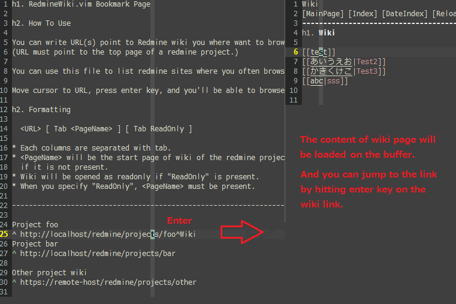

vim-redminewiki
==============

説明
-----------
RedmineのWikiを閲覧するためのVimプラグインです。

使い方
-----------
このプラグインをいれると、':ReadmineWikiBookmark' というコマンドが追加されます。
ReadmineWikiBookmarkコマンドを実行すると、上記のようなブックマークページを表示します。
このブックマークページは、~/(.vim)|(vimfiles)/redminewiki/bookmark.list に保存されています。

ブックマークページ上のURL部分にカーソルをおき、Enterキーを押すと、
URLの内容を読み込み、Wikiのソースをバッファ上に表示します。
バッファ上でWikiを編集し、保存を行うと、変更内容がサーバ側に反映されます。

また、Wikiページへのリンクを上でEnterキーを押すと、リンク先ページを表示・編集することができます。

必要なもの
--------
vim-redminewikiプラグインを利用するには以下のものが必要です。

* [curl command](http://curl.haxx.se/) : http://curl.haxx.se/
* [webapi-vim](https://github.com/mattn/webapi-vim) : https://github.com/mattn/webapi-vim	

オプション
--------

openbrowser.vimをいれると、バッファ上に表示しているWikiページをブラウザで表示することができます。
* [openbrowser.vim](https://github.com/tyru/open-browser.vim) : https://github.com/tyru/open-browser.vim

vim-syntax-redminewikiをいれると、バッファ上に表示しているWikiページをシンタックスハイライト表示することができます。
* [vim-syntax-redminewiki](https://github.com/s3rvac/vim-syntax-redminewiki) : https://github.com/s3rvac/vim-syntax-redminewiki

その他
--------
* 初回アクセス時にAPIキーをプロンプトで入力しますが、ここで入力キーは「.vim/redminewiki/apikeys.json」に保存します。
g:redminewiki_datadir変数で設定保存先ディレクトリを変更できます

* Windowsでしか動作確認してません

制限
--------
* このプラグインで新規作成したページはすべてルートページとなります
(2015/6/14時点では、REST API経由で作成するページの親ページを指定することができないため)

