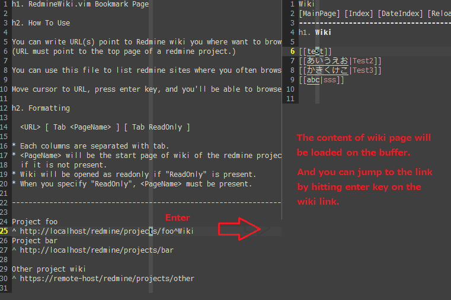

vim-redminewiki
==============

Description
-----------
A vim plugin to browse redmine wiki.

The above is the bookmark page. In order to show your bookmark page, execute ':RedmineWikiBookmark' command.
By default it's located in ~/(.vim)|(vimfiles)/redminewiki/bookmark.list.
Place your cursor on URL and press enter key to open a wiki.
Once pressed, the content of wiki page will be loaded to the buffer.
Edit the buffer and save it to reflect the change to the wiki.

Requires
--------
* [curl command](http://curl.haxx.se/) : http://curl.haxx.se/
* [webapi-vim](https://github.com/mattn/webapi-vim) : https://github.com/mattn/webapi-vim	

Optional
--------
* [openbrowser.vim](https://github.com/tyru/open-browser.vim) : https://github.com/tyru/open-browser.vim
* [vim-syntax-redminewiki](https://github.com/s3rvac/vim-syntax-redminewiki) : https://github.com/s3rvac/vim-syntax-redminewiki

